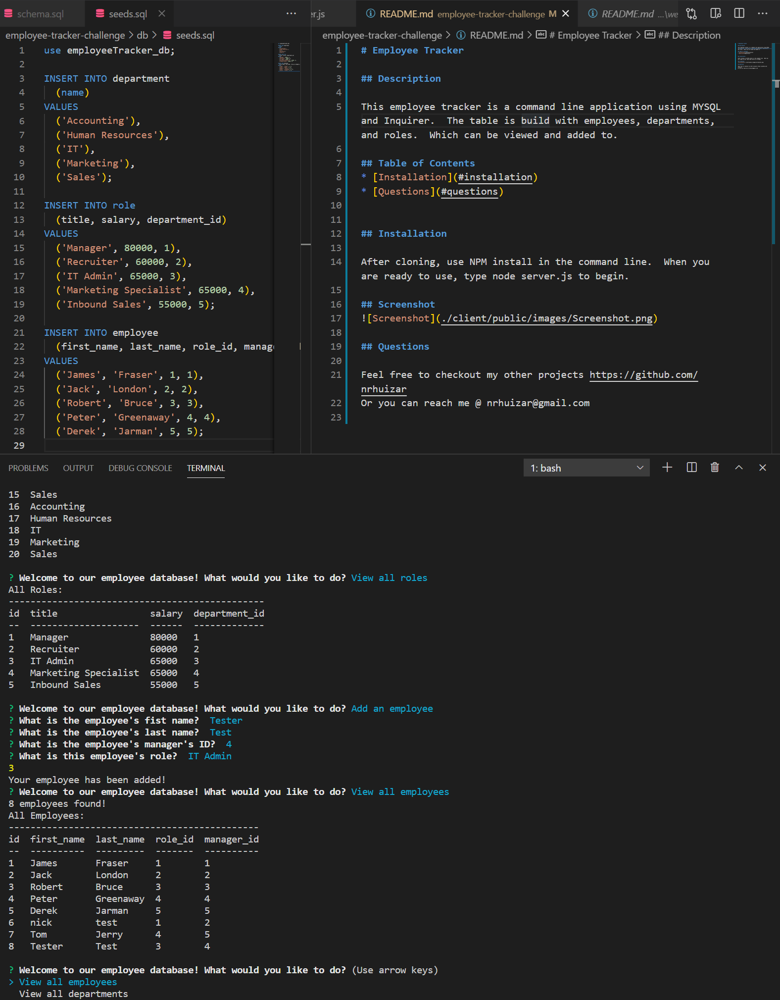

# Employee Tracker

## Description

This employee tracker is a command line application using MYSQL and Inquirer.  The table is build with employees, departments, and roles.  Which can be viewed and added to.

## Table of Contents
* [Installation](#installation)
* [Questions](#questions)

## Installation

After cloning, use NPM install in the command line.  When you are ready to use, type node server.js to begin. 

## Screenshot

## Questions  

Feel free to checkout my other projects https://github.com/nrhuizar
Or you can reach me @ nrhuizar@gmail.com
